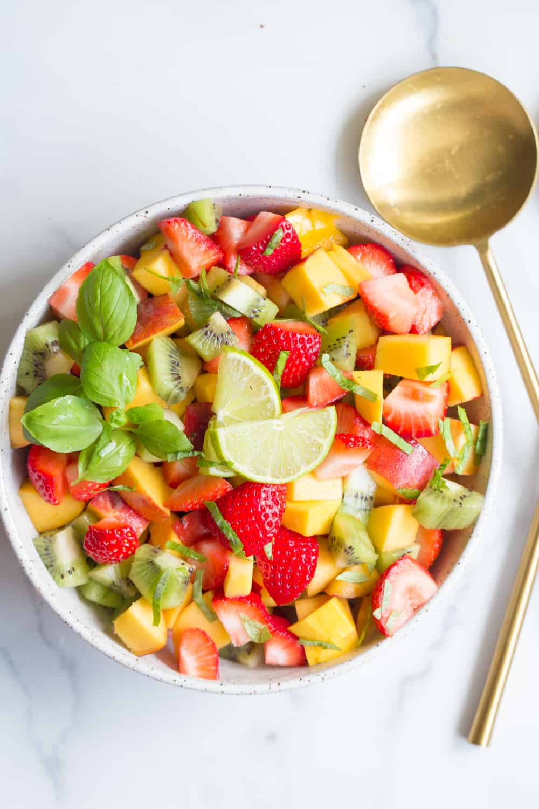

```{r xaringan-themer, include=FALSE, warning=FALSE}
library(xaringanthemer)
style_duo_accent_inverse(
  primary_color = "#D4A59A",
  secondary_color = "#FF341037",
  header_font_google = google_font("Josefin Sans"),
  text_font_google = google_font("Monserrat", "300", "300i"),
  code_font_family = "Fira Code",
  code_font_url = "https://cdn.jsdelivr.net/gh/tonsky/FiraCode@2/distr/fira_code.css")
```
layout: true
# Qu'est-ce qu'il y a dans une salade de fruits?  
---
class: center, middle
background-image: url("fruit-salad-revised.png")
background-size: cover
???
Qu'est-ce qu'il y a dans une salade de fruits?
---
.pull-right[

]
## Les Fruits

1. Des fraises 

--
2. Des myrtilles  

--
3. de la mangue  

--
4. du raisin  

--
5. des bananes

--
6. des kiwis  

--
7. de la orange  
---
.pull-right[

]
## La "Vinaigrette"

1. du miel  

--
2. des zestes de citron vert  

--
3. du jus de citron vert  

---
layout: false
class: center, middle
background-image: url("cookingimage2.png")
background-size: cover
# Comment est-ce qu'on fait une salade de fruits? 
---
exclude: true
layout: true
---
# Comment est-ce qu'on fait une salade de fruits?  

##Pour préparez les fruits
.pull-right[]
- D'abord, lavez et sechez les fruits.

--
- Ensuite, coupez les fraises, de la mangue, du raisin, des bananes, et des kiwis  

--
- Puis, ajoutez les myrtilles et de la orange aussi  
---
# Comment est-ce qu'on fait une salade de fruits?  

## Pour préparez la "Vinaigrette"
.pull-right[]
- C'est très simple: mélangez du miel, des zestes de citron vert, et du jus de citron vert aussi.
---
# Comment est-ce qu'on fait une salade de fruits?  
.pull-left[
- Finalement, versez la "vinaigrette" sur la salade de fruits et mélangez bien.]
.pull-right[]
---
class: center, middle
background-image: url("bowl.jpg")

# C'est facile de faire une salade de fruits?
## Oui. C'est très simple.  

---
class: center, middle, inverse
#bon appétit!🍎❤️
## Je préfére manger une salade de fruits en été pour la dîner quand il fait beau.